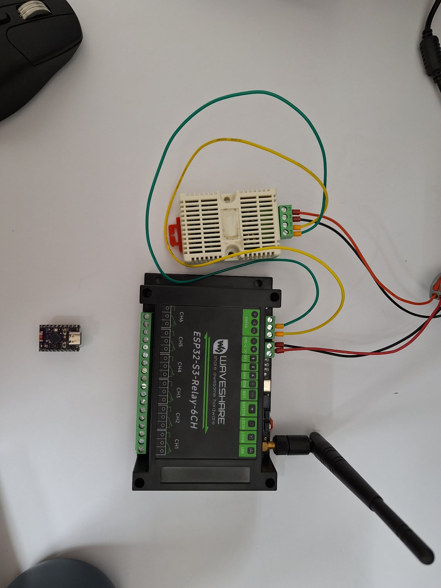

# esp32MODBUSTCP

A two-node Modbus RTU → TCP gateway demo using ESP32 boards. An **ESP32-S3** polls an XY-MD02 temperature/humidity sensor over RS485 (Modbus RTU) and republishes the readings as a **Modbus TCP slave** on port 502. An **ESP32-C6** acts as a **Modbus TCP master**, discovers the slave over mDNS, and polls those registers over WiFi.

```
[XY-MD02] --RS485/RTU--> [ESP32-S3 Gateway] --WiFi/TCP:502--> [ESP32-C6 Master]
```

## Sketches

### `esp32s3_tcp_slave/`
Runs on a **Waveshare ESP32-S3-Relay-6CH**. Acts as:
- **Modbus RTU master** to the XY-MD02 sensor (FC04, addr `0x01`, register `0x0001`, qty 2) on UART1 (TX=GPIO17, RX=GPIO18, 9600 8N1).
- **Modbus TCP slave** on port 502, advertised over mDNS as `esp32s3-modbus.local`.
- **HTTP config server** on port 80 — open `http://esp32s3-modbus.local/` in a browser to edit the holding-register map (which source feeds which register, type, scale, description). Saved to flash; survives reboots.

Polls the sensor every 2 seconds, manually builds the RTU frame and validates CRC-16. Auto-reconnects WiFi if the link drops.

#### Configurable register map
The map is no longer hard-coded. Each entry has:
- **address** — Modbus holding-register address (32-bit types span two consecutive registers, big-endian word order)
- **source** — `temp_c`, `humidity`, `status`, `poll_count`, `uptime_s`, `wifi_rssi`, or `free_heap`
- **type** — `uint16`, `int16`, `uint32`, `int32`, or `float32`
- **scale** — multiplier applied before packing (e.g. `10` to store `24.3 °C` as `243` in an int16)
- **description** — free-form label for humans (visible in the web UI, also exposed via `GET /api/config`)

The defaults match the original hard-coded map (HR0=temp×10, HR1=humi×10, HR2=status, HR3=poll_count). Use the **Reset to defaults** button in the web UI to restore.

#### HTTP API
| Method | Path                  | Purpose                                       |
|--------|-----------------------|-----------------------------------------------|
| GET    | `/`                   | Web UI (single HTML page)                     |
| GET    | `/api/config`         | Current register table + enum metadata (JSON) |
| POST   | `/api/config`         | Replace register table; saves and reboots    |
| POST   | `/api/config/reset`   | Restore defaults; saves and reboots          |
| GET    | `/api/live`           | Current register values keyed by address     |

### `esp32c6_tcp_master/`
Runs on an **ESP32-C6 Dev Module**. Connects to the same WiFi, resolves the slave by mDNS hostname, and polls every 3 seconds via FC03. Includes per-transaction timeouts, TCP-handshake wait, and WiFi reconnect.

## Holding Register Map (FC03, 0-based)

| Reg | Name        | Format                                    |
|-----|-------------|-------------------------------------------|
| 0   | Temperature | int16, ×0.1 °C                            |
| 1   | Humidity    | uint16, ×0.1 %RH                          |
| 2   | Status      | 0=OK, 1=timeout, 2=CRC err, 3=exception   |
| 3   | Poll count  | uint16, rolls over at 65535               |

## RS485 wiring

```
ESP32-S3 A(+)  ----  XY-MD02 A(+)
ESP32-S3 B(-)  ----  XY-MD02 B(-)
ESP32-S3 GND   ----  XY-MD02 GND
                     XY-MD02 VCC -> 5..30 V supply
```

The Waveshare ESP32-S3-Relay-6CH has an onboard RS485 transceiver wired to UART1. If you port this to a board that needs manual DE/RE direction control, define `DIR_PIN` in the slave sketch.

## Configuration

Credentials are kept out of git. For each sketch, copy the example file and fill in your values:

```bash
cp esp32s3_tcp_slave/secrets.h.example  esp32s3_tcp_slave/secrets.h
cp esp32c6_tcp_master/secrets.h.example esp32c6_tcp_master/secrets.h
```

Then edit `secrets.h` in each directory:

```c
#define WIFI_SSID "your-ssid"
#define WIFI_PASS "your-password"
// master only:
#define SLAVE_HOSTNAME "esp32s3-modbus"
```

`secrets.h` is in `.gitignore` so it will never be committed.

## Build

### Arduino IDE
1. Install ESP32 board support (Boards Manager).
2. Install **modbus-esp8266** by emelianov (Library Manager).
3. Open each `.ino`, select the matching board (`ESP32S3 Dev Module` / `ESP32C6 Dev Module`), enable USB CDC, and upload.

### PlatformIO
```bash
pio run -e esp32s3_tcp_slave  -t upload
pio run -e esp32c6_tcp_master -t upload
pio device monitor
```

## Sample serial output

Slave:
```
===========================================
 ESP32-S3 Modbus RTU->TCP Gateway
 RTU Master (XY-MD02) + TCP Slave (:502)
===========================================
RS485: UART1 TX=GPIO17 RX=GPIO18 9600 baud
Connecting to WiFi 'my-ssid'.....
WiFi connected! IP: 192.168.1.146
mDNS: esp32s3-modbus.local
TCP Slave listening on port 502
XY-MD02: 24.3C  41.2%RH  [OK #1]
[TCP] Client connected: 192.168.1.147
XY-MD02: 24.3C  41.2%RH  [OK #2]
```

Master:
```
Resolving esp32s3-modbus.local via mDNS...
Slave resolved: esp32s3-modbus -> 192.168.1.146
Connecting to slave 192.168.1.146:502...
+--------------------------------------+
|  Temperature:    24.3 C              |
|  Humidity:       41.2 %RH            |
|  Slave polls: 12     Status: OK      |
|  [Master OK: 1  ERR: 0]
+--------------------------------------+
```

## Troubleshooting

- **`mDNS lookup failed`** — both devices must be on the same L2 network/VLAN; some guest networks and mesh APs block multicast. Fall back to a static IP if needed.
- **`XY-MD02: ERROR (status=1)`** — RS485 timeout. Check A/B polarity (swap if unsure), shared GND, sensor power, and that no other RTU master is on the bus.
- **`status=2`** — CRC error, almost always wiring noise or a baud-rate mismatch.
- **WiFi never connects** — the ESP32-C6/S3 radios are 2.4 GHz only; make sure your SSID is on the 2.4 GHz band, not 5 GHz.
- **`TCP connect failed`** — verify the slave is up and reachable (`ping esp32s3-modbus.local`), and that nothing else holds port 502.

## Security

Modbus TCP has **no authentication or encryption** by design. Anyone who can reach port 502 can read (and, on a writable slave, modify) registers. Keep this device on a trusted LAN/VLAN; **do not expose it to the public internet**.

## Hardware Pictures



- Waveshare ESP32S3 Relay 6-ch is MODBUSTCP SLAVE (also served as MODBUS RTU MASTER)
Green and Yellow connected to XY-MD02 are modbusRTU A and B wire
Red and Black are Voltage Supply (30 V)

- ESP32C6 Super Mini Below is MODBUSTCP MASTER

## License

MIT — see [LICENSE](LICENSE).
